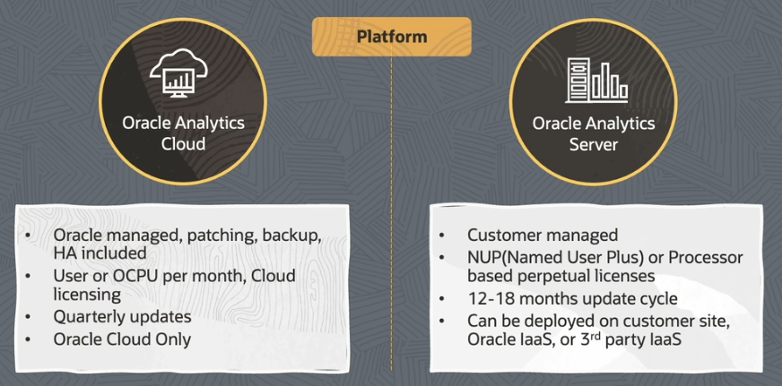
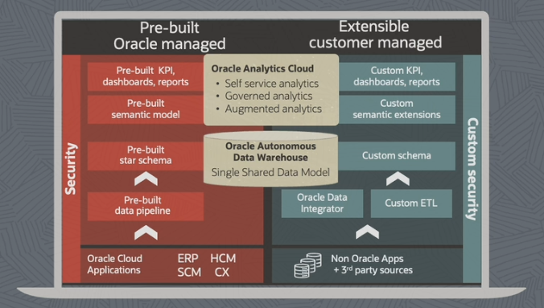

# Oracle Analytics Products

Oracle Analytics has two **platform** offerings:
- Oracle Analytics Cloud
- Oracle Analytics Server (on-prem version)

Oracle Analytics is also offered as a **SaaS**:
- Fusion Analytics Warehouse
- NetSuite Analytics Warehouse

## Oracle Analytics Cloud

Oracle Analytics Cloud is a **comprehensive** analytics cloud platform:
- data connectors
- data preparation
- data visualization
- data quality
- data flows
- predictive analytics 
- advanced analytics 

Oracle Analytics Cloud is:
- self upgrading
- self patching
- self securing

## Oracle Analytics Server

Oracle Analytics Server is a modern analytics platform **on-premises**.

Oracle Analytics Server supports **hybrid cloud configurations**.

For any **regulatory requirements**, if you cannot migrate your data outside your customer data center, then Oracle Analytics Server provides you with a hybrid cloud support, where you can deploy your Oracle Analytics Server on the cloud version. You can still have your data available or residing on-premises in your customer data center and you can still generate insights out of it.

## Oracle Analytics Cloud vs Oracle Analytics Server 

## Fusion Analytics Warehouse

Fusion Analytics Warehouse is a SaaS solution which comprises of:
- Oracle Analytics Cloud
- Fusion Analytics Warehouse
- Autonomous Data Warehouse

How is it different from your standalone Oracle Analytics Cloud?  

Fusion Analytics Warehouse comes up with:
- prebuilt data (in your data warehouse)
- prebuilt semantics
- prebuilt analytics content

