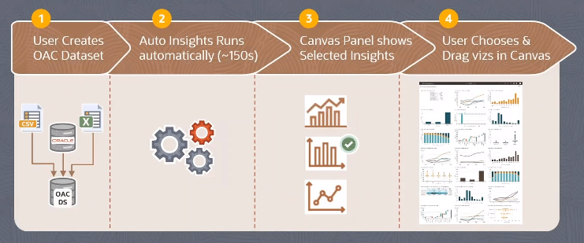

# Augmented Analytics Capabilities

## Oracle BI Ask

With Oracle BI Ask you can talk to data using natural language query. The search includes projects, dashboards, datasets and ML models. The system **auto generates** context visualizations on the fly.

## Explain Functionality

Explain functionality works on data sets only. 

With **Explain Attribute** you get:
- Basic Facts about the attribute (data variety)
    - i.e. What are the values of the attribute and how do the relate to each other?
- Key Drivers of the attribute
    - i.e. What elements in this data best explain the values of the attribute?
- Segments that Explain then attribute
    - i.e. What hidden groups in the data can predict outcomes for the attribute?
- Anomalies of the attribute
    - i.e. What groups in the data exhibit unexpected results for the attribute?

## Auto Insights

Auto Insights works on data sets.

Auto Insights provides visualizations that allows users to choose instead of building visual from scracth.

## Natural Language Generation

Natural Language Generation provides an instant auto-narrative that explains visualizations.

It uses various predictive analytics capabilities to generate insights to read and understand your visual.